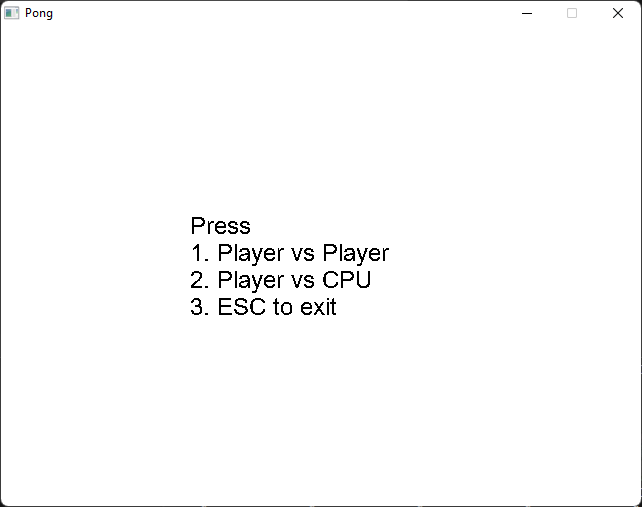
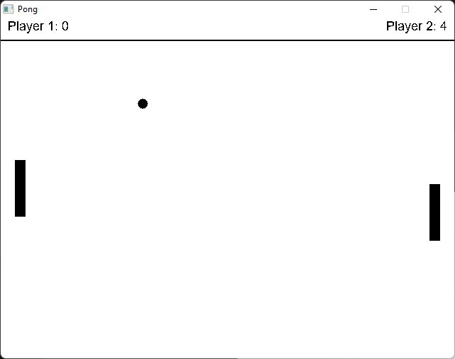

# Pong game

Hey this is Pong! Everyone knows Pong :D

## What does it do?

This is Pong written in C++, you can play against another player or vs computer.

## What is needed?

You need SDL2 libraries and Windows. I don't know if it works on linux because TTF_OpenFont is set to a windows path. 

## Usage

compile by using

gcc -o pong2 pong2.c -I"C:\percorso\verso\SDL2\include" -L"C:\percorso\verso\SDL2\lib" -lmingw32 -lSDL2main -lSDL2 -lSDL2_ttf -lSDL2_gfx

## Example

## Contributing
Contributions are welcome! Feel free to submit a pull request.
